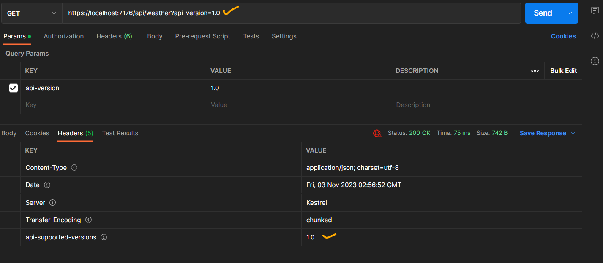
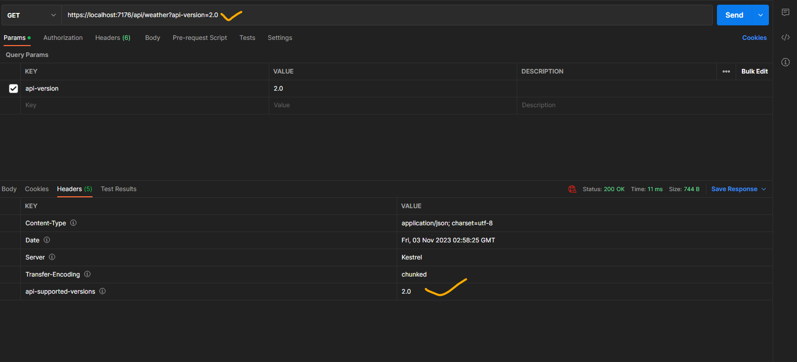
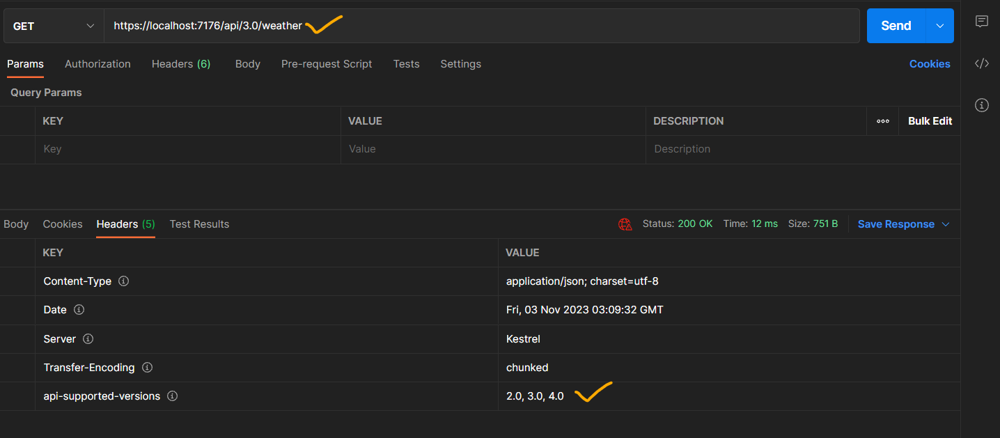
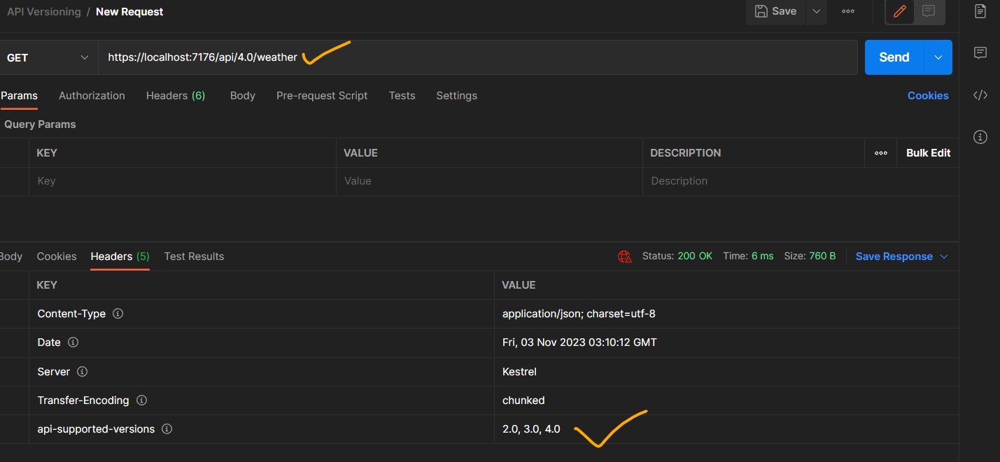
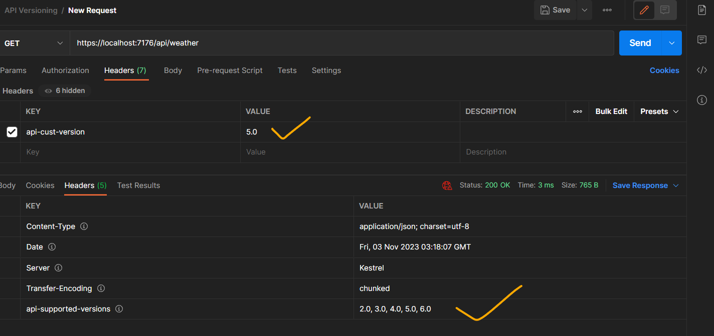
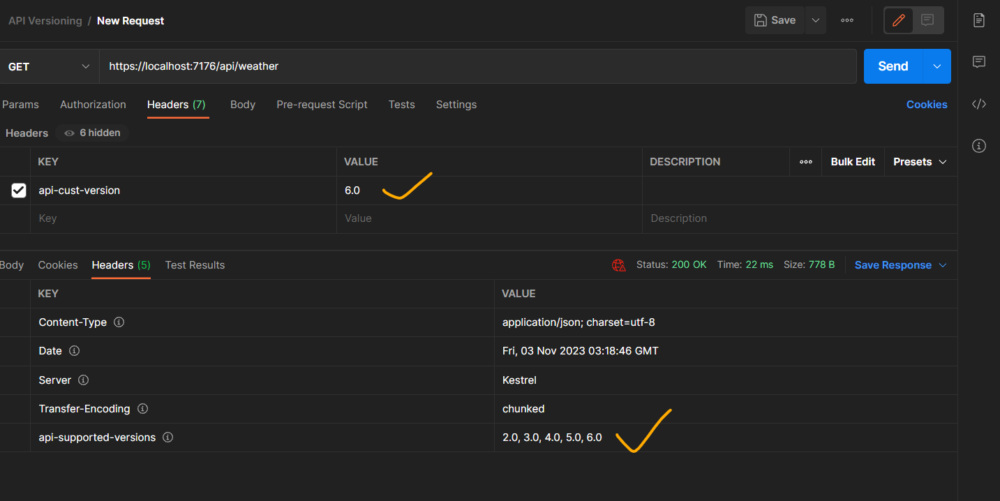

# APIVersioningPoc

**Intent** :- Moreover, requirements change over time � thus, our API has to change as well.

When we implement some breaking changes, we want to ensure that we don�t do anything that will cause our API consumers to change their code. Those breaking changes could be:

1. Renaming fields, properties, or resource URIs.
2. Changes in the payload structure.
3. Modifying response codes or HTTP Verbs.
4. Redesigning our API endpoints.

If we have to implement some of these changes in the already working API, the best way is to apply versioning to prevent breaking our API for the existing API consumers.

**Using Query String**

**Using URL Version**

**HTTP Header Versioning**

**intent** :- If we don’t want to change the URI of the API, we can send the version in the HTTP Header.
To enable this, we have to modify our configuration **opt.ApiVersionReader = new HeaderApiVersionReader("api-version");**

